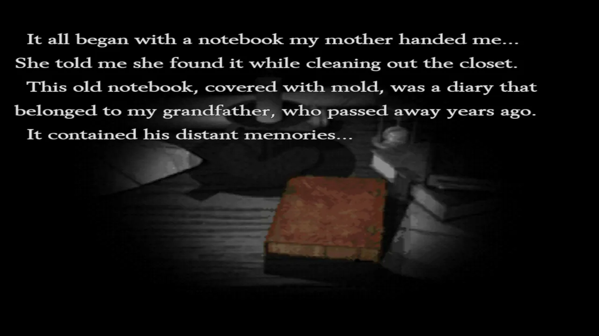
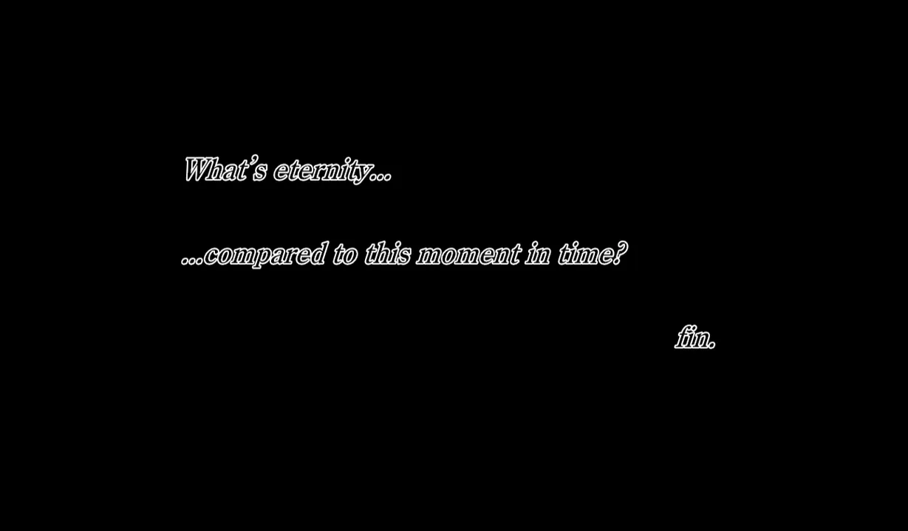
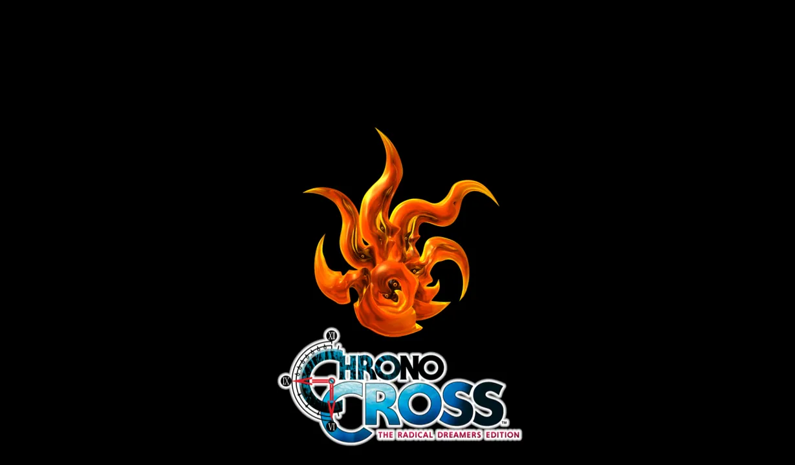

# Radical Dreamers：路线与致谢

## Route

无论地图差异如何，我提供了两个选项。我也不知道为什么最后做了两个。

### Choices

请记住，在遭遇战和处理陷阱时，选择时间有限。务必自己做出选择，而不是让游戏替你决定。

### Random Encounters

选择的结果也是随机的，所以同样的操作可能不会生效两次。总的来说，我唯一的建议是经常存档，并且永远不要从战斗中撤退。

### Minimalist Route

严格来说，我认为你只需要访问以下地点即可完成一次令人满意的游玩，并找到所有提示来自己解决问题。如果跳过大部分提示，流程甚至可以更短，但我还需要测试。目前我用 `*` 标记了那些我认为可以跳过的房间。

- `Outside`：开始。
- `* Clock Tower`：记住这里有一把剑，稍后会用到。
- `* Corridor (Vault)`：确认门已锁。
- `* Lynx's Room`：向镜子询问 `Vault Key`。
- `Study`：获取 `Vault Key`。
- `Vault`：获取 `Hand-shaped Plate`。
- `Atrium`：返回并找到 `Mouth of Truth`。
- `Mouth of Truth`：使用 `Hand-shaped Plate`。
- `Guard Room`：获取 `Catacombs Key`。
- `* Kitchen`：了解最终陷阱的解决方法。
- `Dungeon`：产生与 `Riddel` 交谈的想法。
- `Riddel's Room`：了解 `Einlanzer` 和 `Execution Chamber` 陷阱。
- `Clock Tower`：获取 `Einlanzer`。
- `Execution Chamber`：获取 `Acacian Signet`。
- `* Lynx's Room`：为镜子的剧情画上句号。
- `Dungeon`：了解 `Main Hall` 的秘密通道。
- `Main Hall`：到达通往 `Cave` 的走廊。
- `Corridor`：在陷阱中幸存。
- `Cave`：结束。

### Walkthrough

以下是我的选择：

地点 | 行动 | 关注点
---|---|---
Outside | `I attacked!` `I attacked!` `We're just getting started!` | 
Riddel's Room | `I opened the chest of drawers.` | 
Lynx's Room | `I asked about Kid.` | Mirror
Study | `I checked the desk.` `Hide under the desk!` | 
Clock Tower | `Defiantly tell her she was right.` `All right then. Please do.` | Sword Healing
Corridor (Vault) | `We went inside.` | 
Execution chamber | `We tried to barge the door down!` | Acacian Signet
Lynx's Room | `I asked it where the key to the vault was.` | Hint
Study | `The book with a purple cover in the far bookcase.` | Vault Key
Corridor (Vault) | `We went inside.` | 
Vault | `We have to be careful!` `I had to save Kid!` `*Any for the entire fight*` | Fake Frozen Flame Hand-shaped Plate
Atrium | `We rushed back the way we came!` | 
Mouth of Truth | `...the hand-shaped plate.` | 
Guard Room | `I sat down next to Magil.` `I suppose that means you want something in return.` `She was out hunting for bugs.` `She caught a beetle and painted it gold.` | Healing Catacombs Key
Kitchen | `I was feeling hungry...` `It was delicious!` `I freed the mouse.` `I ducked to dodge the attack!` | Healing Hint
Dungeon | `I...think so...` | Prisoner
Riddel's Room | 无需选择 | Hint
Clock Tower | `My jaw dropped.` | Einlanzer
Execution Chamber | `I plunged the sword into the ground!` | Acacian Signet
Main Hall | 无需选择 | 
Lynx's Room | 无需选择 | 
Dungeon | `I asked Magil to make Kid stop.` | Hint
Main Hall | `We'll win, I promise.` | 
Corridor | `What is the Frozen Flame?` `I turned right three times.` `I turned left twice.` `I turned right twice.` | 
Cave | `I challenged Lynx!` `Don't worry about me!` `I tried to protect Kid!` | 

## Credits

## Teaser

既然我们已经完成了 `Chrono Cross` 和 `Radical Dreamers`，是时候从游戏启动菜单观看演职员表了。

演职员表播放完毕且音乐停止后，你会看到一段简短的先导预告。希望它能有所作为，不像 `Final Fantasy X-3` 的那个。

## Thank You

希望本攻略对你有所帮助。现在去催促 Square Enix，直到他们也给 `Parasite Eve` 出一个像这样的重制版 :)

