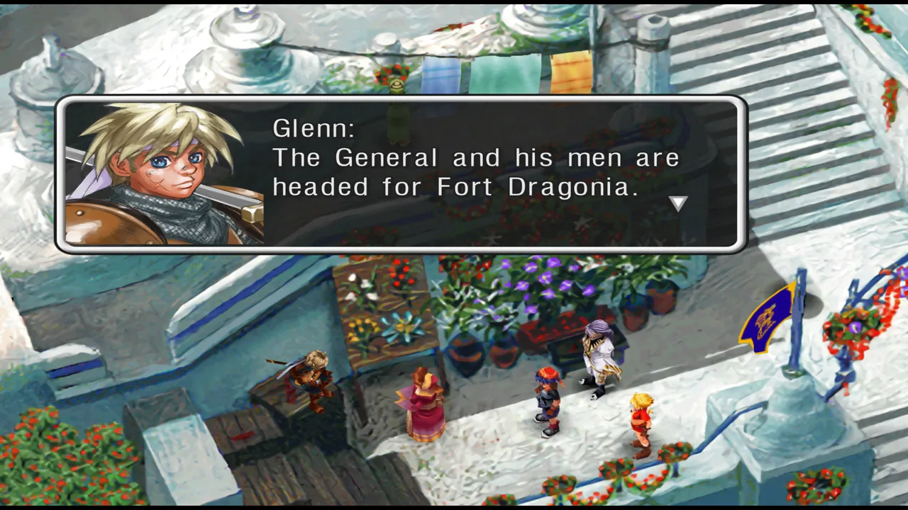
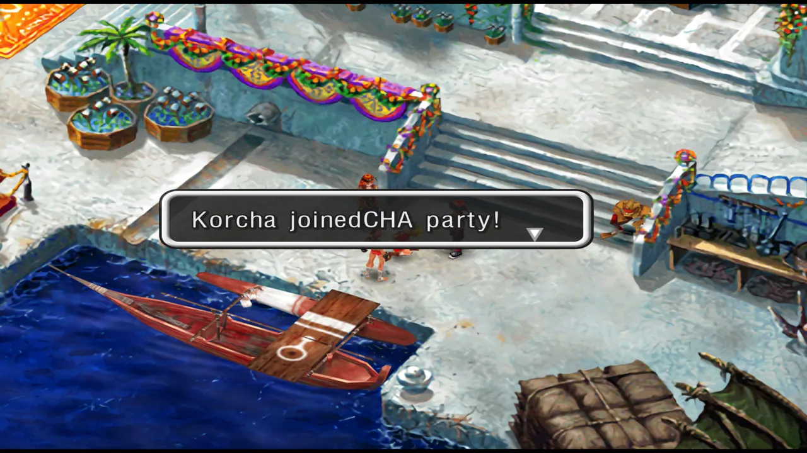
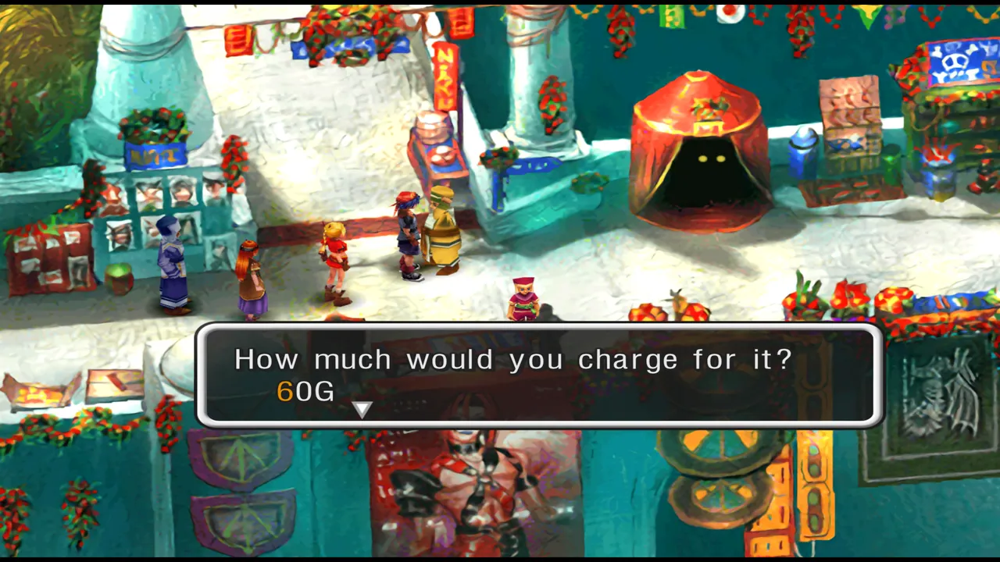
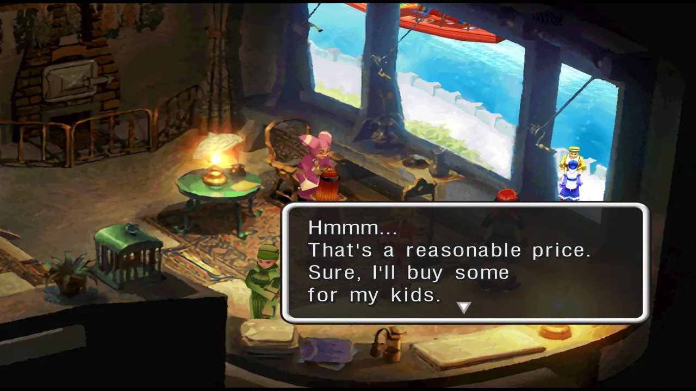

# 开局与三次分支

本攻略面向 Steam 版《CHRONO CROSS: THE RADICAL DREAMERS EDITION》，也适用于 PS1 原版。
文中「Home World」指 Serge 原本所在的世界，「Another World」指 Serge 穿越后到达的平行世界。

游戏中存在三次重大选择，会决定当前周目中哪些角色可以加入：

- **Branch 1**：是否与 Kid 同行（Cape Howl）
- **Branch 2**：选择 Guile / Pierre / Nikki 作为向导（Termina）
- **Branch 3**：是否救 Kid（Guldove）

本攻略假设你在 Branch 1 拒绝 Kid（收 Leena）、Branch 2 选择 Guile、Branch 3 选择救 Kid。

---

## 开篇梦境

游戏以一段动画开场，Serge、Kid 和一名随机队友身处 Fort Dragonia 塔内。
向右走进入迷宫，直接走到尽头调查黑色水晶将其关闭，再站到房间中央的传送装置上按调查键，被传送到上层触发过场。

敌人：Cybot（黄）、Combat（黑）

---

## Home World · Arni Village

Serge 在家中醒来。

1. 检查床下，获得 **200G**。
2. 检查房间左侧角落，获得 **Tablet**（红元素）。
3. 下楼与母亲 Marge 对话，然后出门。
4. 出门后先向左走，与挂在大鱼旁的渔夫对话，选择「きっとそうだね！ / You're probably right!」，获得 **Komodo Scale**。
5. 前往村子右上方的 Kiki 家。与楼上的老太太对话，再到地下室与 Kiki 的父亲对话，获得 **Shark Tooth**。
6. 前往餐厅（Kiki 家下方），进入里间检查床下获得 **Heckran Bone**；检查宝箱获得 **Ivory Helmet**。与穿红裙的女孩谈论诗词——记住她，之后有用。
7. 调查女孩身后的木桶 4 次，获得 **Uplift**（黄元素）。
8. 到村子左方的广场，对粉色小狗 Poshul 使用 **Heckran Bone**，Poshul 加入。建议首次游玩时与旁边的老人 Radius 对话，学习战斗和元素系统。
9. 调查 Poshul 狗窝右侧的水桶，获得 **PhotonRay**（白元素）。进入 Poshul 家，调查左侧挂轴后获得 **Cure**（蓝元素）。
10. 调查 Element 商店（村子中央的推车），获得 **Shellfish** 对话框。
11. 走到栈桥与 Leena 对话，她会让你去 Lizard Rock 收集 3 片 Komodo Scale。注意：之前获得的 Komodo Scale 交给她不会生效。

---

## Home World · Lizard Rock

从 Arni Village 南边进入 Lizard Rock。

1. 入口处推开通路岩石。
2. 从中间的路走，惊动一只 Komodo Pup。先把洞穴旁的岩石推过来堵住下方出口，再到上方把 Komodo Pup 赶进洞中，战斗获胜获得第一片 **Komodo Scale**。
3. 击败右侧的怪物，打开宝箱获得 **Fireball**（红元素）。
4. 回到主路向左走，惊动第二只 Komodo Pup。走上倒下的树干，击败上面的怪物。走到高台边缘，在 Komodo Pup 走近时按调查键跳下，落在它身上即可触发战斗，获得第二片 **Komodo Scale**。
5. 继续向左下方走，看到水中沉没的宝箱。把岩石推进水里，宝箱浮起，获得 **Silver Loupe**。
6. 沿左侧路向上走，过桥后右侧水中有宝箱，从桥右下方小路绕过去获得 **Tablet**。
7. 继续追踪第三只 Komodo Pup。在左上方的洞里跳下到达两个宝箱：中间 **@Bone**，水中 **Ivory Helmet**。
8. 击败第三只 Komodo Pup 后，**Mama Komodo** 出现。

### Boss：Mama Komodo（蓝）

- HP：160 / 攻击：13 / 魔攻：7 / 防御：1 / 魔防：0
- 偷窃：@Fang（普通）/ Tablet（稀有）
- 掉落：@Fang / Tablet / 金币：216G

有 Poshul 在队伍中会轻松很多。Serge 单独作战时，攻击到只剩 1 点耐力就防御，需要时用 Cure 回复。战斗胜利后获得第一颗 ★。

绕道去一趟 **Cape Howl**（Arni Village 西偏北方向）。那里有两个宝箱：**Heal**（绿元素）和 **@Bone**。

---

## Home World · Opassa Beach

从 Lizard Rock 南侧离开到达 Opassa Beach。与 Leena 对话时，选择：

1. 「おぼえてる / I remember」
2. 「ずっと、おぼえてるよ / We'll never forget this day」

这是 Leena 获得 Lv.7 必杀技「Maiden's Faith / 乙女の祈り」的前置条件。过场后 Serge 穿越到 Another World。

---

## Another World · Arni Village

在 Opassa Beach 醒来后穿过 Lizard Rock 返回 Arni Village（怪物和宝箱位置与 Home World 不同）。

1. 进入 Serge 的家，发现被陌生人占据。上楼在杂物堆后找到 **MagmaBomb**（红元素）。离开时会被屋主质问。
2. 前往餐厅，里屋帘子后面有 **Tablet**。与穿蓝裙的女孩谈论诗词——得到与 Home World 相反的回应。
3. 与女孩旁边的罐子对话 4 次，获得 **IceLance**（蓝元素）。
4. 前往 Radius 的小屋（村子左边），现在是 Gonji 的住所。挂轴后有 **Tablet**。屋外楼梯旁水桶有 **TurnRed**（红元素）。
5. 前往 Kiki 家地下室，看到 Kiki 的父亲在向神像祈祷——记住这里。
6. 前往 Leena 和 Poshul 的家，狗窝旁水桶获得另一颗 **PhotonRay**（白元素）。
7. 到栈桥与 Leena 对话，然后前往 **Cape Howl**。

---

## Another World · Cape Howl（Branch 1：是否与 Kid 同行）

上到悬崖顶端检查墓碑——Serge 在这个世界已经死了。Solt、Peppor 和 Karsh 出现。如果之前招募了 Poshul，Poshul 会被踢下悬崖。战斗开始，Kid 出场帮助。

### Boss：Karsh、Solt、Peppor

| | Karsh（绿） | Solt（黄） | Peppor（黄） |
|---|---|---|---|
| HP | 115 | 52 | 60 |
| 偷窃（普通） | Copper | Tablet | Ivory Helmet |
| 偷窃（稀有） | Power Glove | Silver Loupe | Tablet |
| 掉落 | Bone Axe / Power Glove | Iron Vest / @Copper | Ivory Helmet / @Copper |
| 金币 | 220G | 40G | 80G |

使用全体攻击元素（如 MagmaBomb），Kid 会使用 Pilfer 偷窃。Solt 和 Peppor 血少，优先解决。

战斗后 Kid 请求加入队伍。这是 **Branch 1**：

- **拒绝 Kid**：连续拒绝三次。之后在 Arni Village 可收 Leena，Kid 仍会在 Termina 加入。推荐首次游玩时选择。
- **接受 Kid**：Kid 立即加入，但 Leena 本周目不会再加入。

Cape Howl 宝箱：**@Bone** 和 **ElectroJolt**（黄元素）。

---

## Another World · Arni Village（Branch 1 拒绝后）

如果你拒绝了 Kid，第二天 Leena 来叫醒你。

- **Leena 加入**：自动加入（如果之前没收 Poshul，Poshul 也会一并加入）。
- **Mojo 加入**：前往 Kiki 家地下室，对 Kiki 的父亲使用 **Shark Tooth**，他会很生气。尝试离开时，神像 Mojo 复活并加入队伍。

---

## Another World · Hydra Marshes

位于 Arni Village 东边。沼泽有毒，没有 Safety Gear 前不要踏入绿色沼泽。

1. 进入后向西穿过沼泽。
2. 沿茎干走到有记录点的区域。右侧茎干顶端有 **ElectroJolt**（黄元素）。
3. 向东走，与中间男子对话获得 **Safety Gear**，此后可安全通过沼泽。

4. 返回第一画面，北面圆木过去获得 **Tablet**，继续向北获得 **Bushwhacker**（绿元素）。

---

## Another World · Fossil Valley

1. 与绳梯前士兵对话，选择「そうだ / Yes we are」自称驱魔人。
2. 爬绳梯上去，调查巨大龙头骨，同意帮助小骷髅，获得 **Heavy Skull**（Skelly 收集品 1/6）。
3. 最左侧悬崖顶端捡到 **Bellflower**。
4. 沿左侧骨头爬下去，从鸟巢中取得 **Big Egg**。

### Boss：Solt（黄 HP80）、Peppor（黄 HP90）

二人教授 Turn 元素。用绿元素攻击即可。通过后前往 **Termina**。

---

## Another World · Termina（Branch 2：选择向导）

1. 前往元素商店 Lisa 处购买元素。
2. 上楼梯，与 Viper 雕像左侧房子后面躲着的 NPC 交谈，获得 **Tea For Three** 对话框。
3. 前往 Zappa 的铁匠铺打造铜装备。
4. 进入铁匠铺前方的宅邸，一楼楼梯后有 **Profiteer Purse**。
5. 从 Korcha 所在处下楼梯，到灵庙墓地触发 Glenn 和 Riddel 的过场。将 **Bellflower** 送给他们。

如果你在 Branch 1 拒绝了 Kid，现在与擦雕像的绿衣男子交谈后 Kid 会再次出现——这次接受她。

之后与擦雕像的男子交谈，需要潜入 Viper Manor。这是 **Branch 2**。

### 分支 A：Guile

1. 到酒吧最左侧里面与 Guile 对话，让他加入。

2. 回到灵庙墓地，付 100G 乘 Korcha 的船前往 Viper Manor 悬崖。

### 分支 B：Pierre

1. 到铁匠铺与 Zappa 对话，再进左侧房间与 Pierre 对话。
2. 出门与院子中跑圈的小男孩对话获得 **Hero's Medal**。
3. 将 Hero's Medal 交给 Pierre，他会加入。之后从 Viper Manor 正门突入。

> **NG+ 提示**：可将 Hero's Medal 还给 Pierre 后选择其他向导，召回时 Pierre 装备着勋章。

### 分支 C：Nikki

1. 进入 Termina 西侧大船，接受 Miki 的请求寻找 Nikki。

2. 前往东侧 **Shadow Forest**。

3. 向西走击败 Bulb 获得 **AeroSaucer**（绿元素）。
4. 向南追踪 Nikki，途中宝箱获得 **Uplift**（黄元素）。
5. 找到 Nikki 后击败 Cassowary（黄 HP100）。
6. 跟着 Nikki 进入瀑布后洞穴，对话后 Nikki 加入。捡起 **Angry Scapula**（Skelly 收集品），宝箱中获得 **Aroma Pouch**。
7. 到右侧岸边的树上使用 Aroma Pouch 产生蓝色花粉，引蓝色生物到挡路 Quadfidd 处让它被吃掉。

   > 也可在左侧高台树上取红色花粉，引红色生物被吃掉，怪物缩小给予 **Skullduggery** 对话框后逃走。

8. 击败 Zoah（黄 HP200）、Solt（黄 HP80）、Peppor（黄 HP90）。Solt 和 Peppor 教授召唤元素。优先解决 Solt 和 Peppor，他们会使用 Crosscut 双人技。
9. 进入洞穴，途中有 **Heal**、**MagmaBomb**。出口附近高台宝箱有 **Deluge**（蓝元素）。

> 三条路线都通向 Viper Manor，只是进入位置不同。

---

## Viper Manor（Another World）

进入庄园后先在后方搜刮：小房间 **TurnBlue**（蓝元素），正门北面 **Ointment**（红元素）。

### 喂龙小游戏

进入马厩玩喂龙游戏，右上柜子中获得 **Manor Key**。喂龙奖励：10 次 Knee Pad、20 次 Bronze Helmet、30 次 Bronze Mail、40 次 RecoverAll（白元素）、100 次 Iron Vest + 成就「Feeding Frenzy」。重制版可开启慢动作降低难度。获得 Manor Key 后存档，用钥匙打开正门。

### 庄园内部探索

1. 大厅调查蛇雕像，随便输入数字，触发陷阱落入地下牢笼。
2. 击败守卫后变装。向左去餐厅方向。
3. 餐厅中与 Glenn 对话。右上角宝箱 **Dragoon's Honor**，厨房柜子 **TurnGreen**（绿元素）。
4. 进入隔壁营房，Glenn 在看墙上密码。与墙壁互动获得密码（每次游戏随机，务必记下）。记录点左侧房间有珍贵的 **Revive**（白元素）。上楼梯。

5. 上楼后有眼睛的门——眼睛闭上时可安全进入。第一个门里是睡觉的 Harle。继续走遇到奇怪宝箱，击败后右侧宝箱 **TurnBlack**（黑元素），左侧是 Boxer Boys。
6. 返回交叉点向右走。与守卫对话保持沉默。搜刮：柱子有 **Bronze Mail**、**Hero's Shield**、**Bronze Sword**，花瓶打败怪物后得 **TurnRed**（红元素）。
7. 检查墙上 **Silver Pendant**，触发陷阱落入 Luccia 的实验室。击败 Neo-N-Bulbs（绿 HP160）。打开 Pip 的笼子放走它。离开时与 Luccia 交谈。
8. 击败外面 Roborg，进入武器库。宝箱 **Bronze Helmet**。推蛇雕像入槽，从墙上取下 **Decor Shield**，放到缺少盾牌的盔甲上。击败 Man-O'-Wars。
9. 向右上楼。Zoah 的房间有宝箱（之后带 Zoah 来才能开）。Karsh 的房间反复调查宝箱 20 次，他最终会让你拿走 **Dragoon Gauntlet**。
10. 回到大厅，在蛇雕像处输入密码进入大房间。向左走过桥到达图书馆。
11. 上楼与 Marcy 对话后战斗。

### Boss：Marcy（蓝）

- HP：525 / 攻击：30 / 魔攻：5 / 防御：0 / 魔防：0
- 偷窃：Silver Loupe（普通）/ Dancing Shoes（稀有）
- 掉落：IceBlast（蓝）/ @Iron
- 金币：780G

她攻击力不高但会用 IceBlast 冻结角色。备好 Medicine 解冻。使用 Turn 元素提升输出。

12. 胜利后预言者给予提示。上楼激活开关降下梯子，上去获得 **TurnWhite**（白元素）。
13. 回到主厅，按左边第二根柱子的开关，击败守卫乘升降机上去。
14. 存档后进入右侧房间，与 Lynx 战斗。

### Boss：Lynx（黑）

- HP：820 / 攻击：26 / 魔攻：10 / 防御：1 / 魔防：7
- 偷窃：Magic Ring（普通）/ Power Glove（稀有）
- 掉落：Pendragon Sigil C / Gravitonne（黑）
- 金币：500G

Lynx 使用 AntiWhite 暂时禁用白色元素。保持场地白色，尽量用白元素和 Serge 的物理攻击。务必偷窃。战斗后众人逃离庄园。

---

## Another World · Guldove（Branch 3：是否救 Kid）

Serge 在 Korcha 家醒来。出外看事件，Kid 中毒昏倒。

1. 在诊所与 Kid 对话获得 **Astral Amulet**（可在两个世界间穿越）。
2. 与元素商人交谈后离开可获得 **Pelvic Bone**（Skelly 收集品）。
3. 进入酒吧观看 Orlha 和 Doc 的对话。
4. 上梯子，右侧小屋有元素商店。
5. 去巫女小屋与 Direa 交谈。
6. 回酒吧与矮人对话多次获得 **Green Tinkler**。

### Branch 3：是否救 Kid

- **Save Kid**：可获得 Korcha、Razzly、Mel。
- **Leave Kid Alone**：可获得 Glenn、Macha、Doc，Astral Amulet 被 Korcha 拿走（之后会归还）。

本攻略选择 Save Kid。

---

## Home World · Hydra Marshes（Save Kid 分支）

回到 Home World 进入 Hydra Marshes。

1. 向东获得 **@Feather**。
2. 跟随妖精灵魂，在分岔路下圆木向东获得 **@Bone**。
3. 返回岔路上茎干获得 **Cure**（蓝元素）。
4. 继续向西跟踪妖精，直到尽头宝箱获得 **Brace**（黄元素）。
5. 返回交叉点向西走，击败 Beeba 获得 **Beeba Flute**。
6. 到右侧开阔地上使用 Beeba Flute 召唤 Wingapede，击败后落入大坑。

### Boss：Pentapus（蓝 HP600）

用红元素和黄元素攻击。落坑后立即向南去打开妖精的笼子——必须尽快，否则 Razzly 会被吃掉并永久丢失。

7. 打开笼子释放 Razzly，她加入。宝箱有 **RecoverAll**（白元素）。
8. 继续前进，在记录点存档后向东北走面对一群矮人。

### Boss：Dwarves

Daggy Dwarf（黄 HP100）×2、Daffy Dwarf（黄 HP90）×3、Dwarf Chieftain（黄 HP140）。使用全体攻击绿元素快速解决。

9. 击败矮人后面对 Hydra。

### Boss：Hydra（黄）

- HP：700
- 偷窃：Tablet / Heal
- 掉落：Upheaval（黄）/ @Copper
- 金币：740G

**重要**：如果想让 Razzly 获得 Lv.7 必杀技「Raz-Flower / ラズフラワー」，不要带 Razzly 参战。Hydra 的 PutridOdor 全体攻击约 50+ 伤害，用绿元素攻击。

10. 检查 Hydra 尸体获得 **Hydra Humour**。

---

## Guldove（Save Kid 分支后续）

1. 将 Hydra Humour 交给 Doc，Kid 康复。
2. Kid 发现元素被偷。对话中选择追回元素，然后去追 Mel。
3. 去巫女小屋打听，再去居住塔抓住 Mel。
4. 乘船回 Termina。

### Termina（Save Kid 分支后续）

1. 入口处触发 Glenn 和花店女子的对话。

2. 去灵庙墓地看 Greco 做法事，跟着他去他家，对话后 **Greco 加入**。
3. 回码头与 Korcha 对话，Kid 开玩笑地接受他的求婚。Korcha 永久加入。
4. 回 Guldove，带 Kid 去居住塔与 Mel 对话，获得 **Guldovian Stitch** 对话框，**Mel 加入**。

---

## Viper Manor & Hydra Marshes（返回探索）

获得船后，可以回去搜刮之前遗漏的内容。

### Viper Manor（Another）

1. 回到图书馆，检查预言者之前站立的桌子后面，发现秘密通道。下去与 Beach Bum 交谈获得 **Porre's Furnace** 对话框。再次交谈可改名。

2. 前往与 Lynx 对峙的阳台，对花使用 **Life Sparkle**，**NeoFio 加入**。
3. 前往 Luccia 的实验室，**Luccia 加入**。

### Hydra Marshes（Another）

有了 Green Tinkler，对挡路的藤蔓使用可开启新路径。

1. 从记录点东北方向深入，在发光洞穴（宝箱左侧）获得 **Good Backbone**（Skelly 收集品）。

2. 继续探索可获得 **@Seed**、**@Carapace**、**@Copper**、**BatEye**。
3. 击败两个哥布林获得 **Life Sparkle**（用于招募 NeoFio）。

### Shadow Forest（Another · 返回探索）

如果 Branch 2 没有选择 Nikki，现在可以进入 Shadow Forest。

- 前往瀑布后洞穴，检查信件捡起 **Angry Scapula**（Skelly 收集品）。
- 从宝箱中拿走 **Aroma Pouch**。在外面使用它吸引红色 Bulb，将其引诱到洞穴左侧挡路的大怪物处。大怪物缩小后获得 **Skullduggery** 对话框。

---

## @Rainbow Shell 收集（早期）

### 诗词交换
1. **Home World** Arni Village：与餐厅穿红裙的女孩交谈获得 **Book of Poems**。
2. **Another World** Arni Village：将 Book of Poems 展示给穿蓝裙的女孩，获得 **@Rainbow Shell**。

### 吉拿棒商贩
在 **Another World** Termina，告诉吉拿棒商贩 100G 太贵、建议 60G。他接受后，回到雕像右侧的房子，你会看到建议带来的回报——另一个 **@Rainbow Shell**。

---

## 当前可收集的 Skelly 零件

| 零件 | 位置 |
|---|---|
| Heavy Skull | Another Fossil Valley 龙头骨 |
| Pelvic Bone | Another Guldove 元素商人 |
| Angry Scapula | Another Shadow Forest 瀑布后洞穴 |
| Good Backbone | Another Hydra Marshes 发光洞穴 |
| Sturdy Ribs | Another Water Dragon Isle 第一区域右上 |
| Mixed Bones | Another Isle of the Damned 左上洞窟 |

集齐 6 个零件后，到 **Another World** Termina 雕像右侧房子，与穿粉衣的女士交谈让 Skelly 与祖母团聚。离开再进入，**Skelly 加入**。

---

## Endings 提示（本章节可触发的结局）

### Ending 1：The Developers' Room
在 New Game+ 中，醒来后不与任何人交谈，直接击败 Time Devourer。

### Ending 2：The Acacian Empire
在 New Game+ 中，在 Branch 2 获得向导前击败 Time Devourer。

### Ending 4：The Shop Staff and the Three Unlikely Heroes
在 New Game+ 中，在 Branch 3 期间 Kid 康复前击败 Time Devourer。
