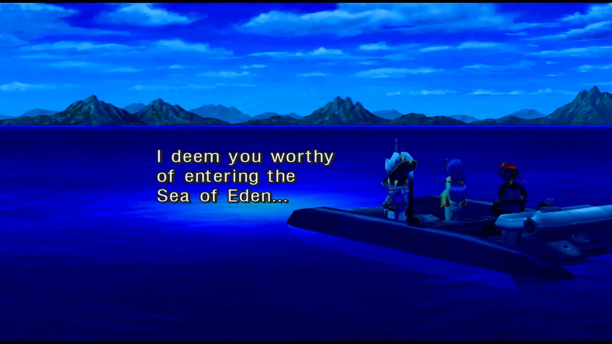
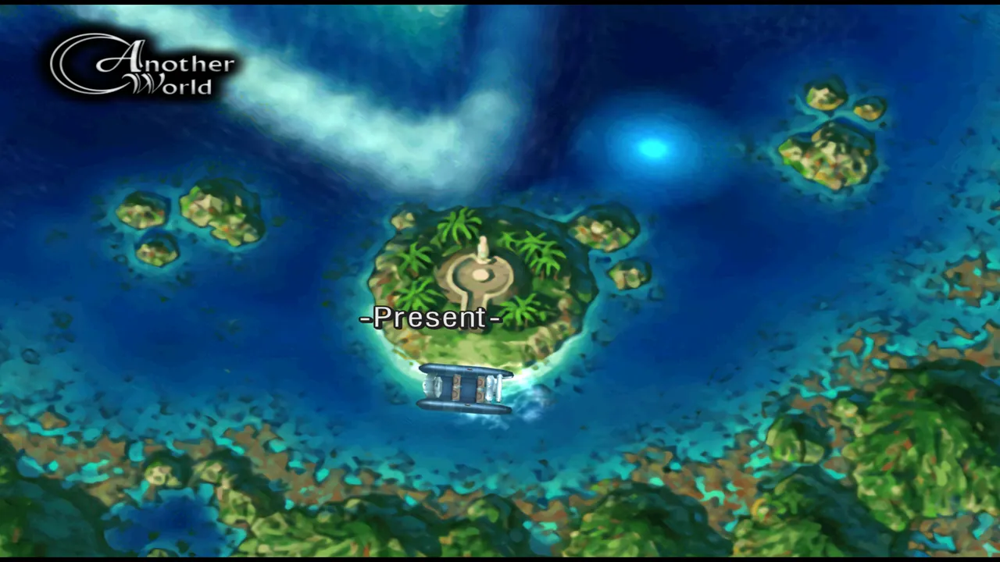
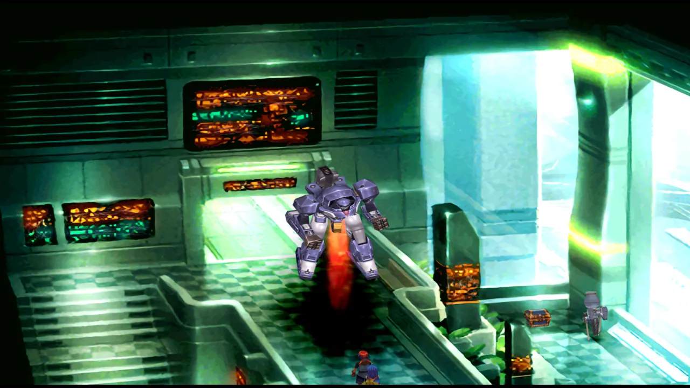
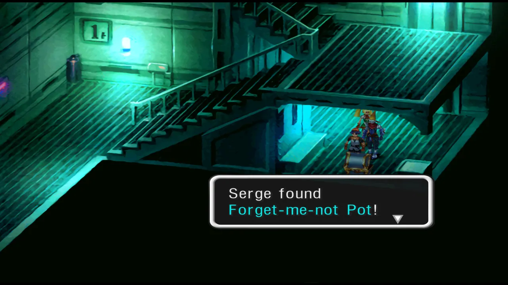
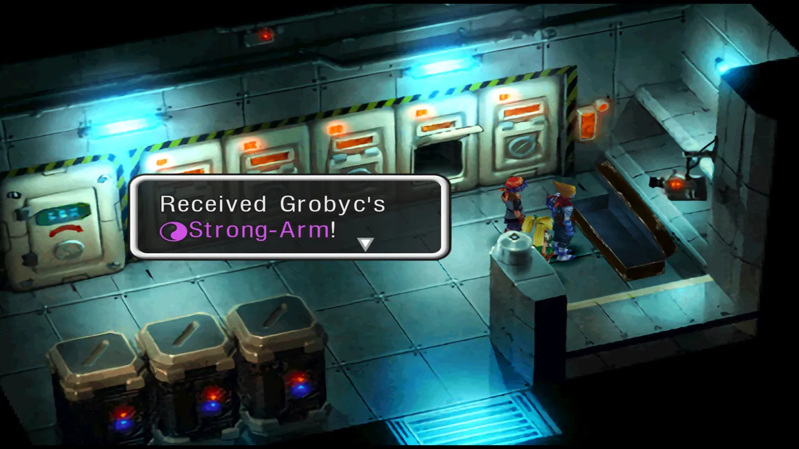
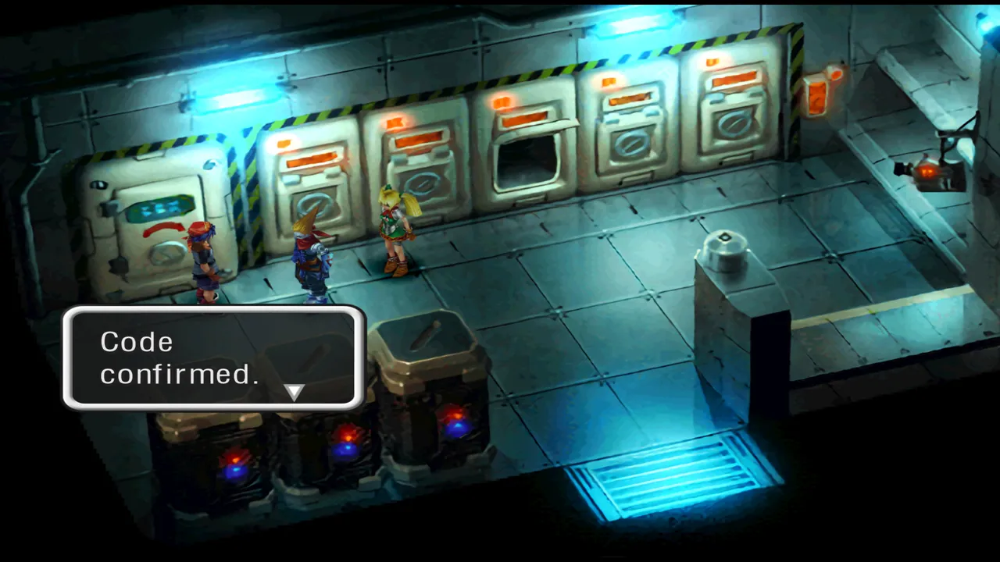
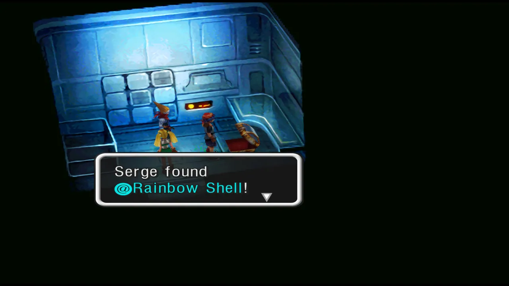

# 流程 03：Viper Manor 再访至 Chronopolis

本章覆盖 Dead Sea 之后至 Chronopolis 击败 FATE 的完整流程，包括 Viper Manor 再访、Dragon's Blessing 屠龙任务、Fort Dragonia 第二次攻略和 Chronopolis。

---

## Another World · Dead Sea 之后

### Arni Village

趁 Element 商人不在时搜刮她的手推车，获得 **@Rainbow Shell**。

### Hydra Marshes

前往 Home World 中救 Razzly 时打开的洞口位置（Another World），从洞口下去击败 Boss 可获得 Steena 的 Tech「Hydra's Shadow」。

### Fossil Valley

带 Draggy 前往获得 Skelly Heavy Skull 的位置，获得 Draggy 的 Lv.7 必杀技 **Big Breath**。

---

## Another World · Termina（Karsh/Zoah 分支）

元素商店已升级，建议补充元素。带 Zappa 去见 Another 的 Zappa，两人讨论 Rainbow 装备锻造但锤子还不行。可锻造 Denadorite 装备。

进入酒吧（元素商店左边），酒吧空无一人。与酒保交谈，他会打开身后的秘密通道。进入见到 Karsh 和 Zoah，对话后获得 **Tear of Hate**。

此时可选择 **Karsh** 或 **Zoah** 加入。推荐选 Zoah（可在 Manor 立即获得他的 Lv.7 必杀技）。未选的那位之后会在 S.S. Invincible 加入。

离开 Termina 时 Norris 会拦住你——他对自己在 Home World 的 Doppelganger 感到震惊。

### 额外对话

带 Funguy 到元素商店后方与自己的 Another 版本对话。带 Van 回家与父亲和 Van 本人对话。

---

## Another World · Viper Manor 再访

确保 Norris 和 Zoah（如果你选了他）在队伍中。

### Zoah Lv.7 Tech

让 Zoah 领队进入 Manor，前往大厅右侧他的房间，打开宝箱获得 **☯Toss&Spike**。

### Norris 获取 Prison Key

带 Norris 进入 Manor，前往大厅左侧第二个房间，与 Another World 的 Norris 对话获得 **Prison Key**。

### 下水道探索

下楼梯进入厨房（中间的门）。从 Orcha 厨房的舱口下到下水道。

1. 进入水中，水流太强无法自由移动。被冲到熟悉的地方。
2. 上平台向右走，把木桶推进水里。向下再向右推第二个木桶。宝箱有 **@Denadorite** 和 **@Humour**。
3. 木桶形成桥，到达左中区域的楼梯。
4. 上去拧紧阀门减少水流。
5. 爬左上角梯子进入监狱区域，可返回 Orcha 厨房。
6. 再次下舱口。水流减弱后可进入房间。第一个右侧路径有绿色史莱姆旁的宝箱——获得 Luccia 后带她来这里。暂时拿走 **Magic Seal**。
7. 回到水中，忽略左侧通道（回到厨房外）。向下一个右侧通道走。交叉口向上再向左。
8. 尽头有阀门，拧紧后下方障碍移动。返回向右走（忽略刚解锁的通道），看到另一个阀门，拧紧。
9. 返回向下再向左，进入水中向右走。尽头向上走。经过小楼梯获得 **Nimble**。
10. 返回爬梯子拧紧阀门移动障碍物。沿新路径走。

### Boss：Roachster（蓝 HP1245）

- 掉落：Elbow Pad
- 金币：1076G

用 Zoah 的 Toss&Spike 开局，然后用最强红元素。Roachster 可连击两次，保持 HP。

击败后爬右侧梯子。Fargo 离开牢房后跟随他到外面，向东走使用记录点。

### Boss：Hell's Cook（红 HP2800）

- 偷窃：Poultice Cap / Mythril
- 掉落：Gold Pendant / Mythril
- 金币：1490G

使用最强蓝元素，对 Orcha 使用 WeakMinded。Orcha 战后悔悟并 **加入**。

### 王座厅与 Grobyc

此时你在主厅。Norris 带着 Riddel 逃走。前往王座厅击败 Porre 士兵。Grobyc 出现挑战。

### Boss：Grobyc（黑 HP2800）

- 偷窃：Black Brooch
- 掉落：Defender / FreeFall
- 金币：1250G

Grobyc 的连击很强。使用 WeakMinded 和最强白元素。HairCutter 和 RocketFist 可打掉大量 HP，随时准备回复。

### Boss：Guillot（黄 HP1001）

- 掉落：@Mythril / @Screw

不要带绿属性角色。场地初始偏黄，快速使用绿元素。分为两战：第一次 HP 归零后逃到图书馆，再次战斗。同样策略。

Guillot 被击败两次后，Grobyc **加入**。

### Viper Manor 秘密谜题（@Rainbow Shell）

1. 前往 Manor 顶部，进入之前与 Lynx 战斗的房间。
2. 与雕像互动打开秘密门。
3. 阅读书桌上的笔记。
4. 回到地下室右侧蛇雕像房间。
5. 从墙上取下 **Decor Shield**。
6. 将 Decor Shield 放在缺少盾牌的盔甲上。
7. 移动蛇雕像使其与另一个匹配。
8. 与房间西北角柱子互动按下开关。
9. 进入秘密房间获得 **@Rainbow Shell** 和 **Viper's Venom**。

---

## Home World · Dead Sea 之后

### Arni Village

带 Orcha 与餐厅厨师对话获得他的 Lv.7 必杀技 **Dinner Guest**。

### Shadow Forest

带 Funguy 与招募他时的洞穴里的小蘑菇对话获得 **Myconoids**。

---

## Another World · Dead Sea 之后（续）

### Marbule

带三名 Demi-human 角色与入口蓝色 NPC 交谈获得 **Valencian Cloth** 对话框。

### Hermit's Hideaway

在烧焦的树内触发事件后 **Riddel 加入**。

### S.S. Invincible

前往甲板下方，Viper、Fargo、Marcy 以及 Karsh 或 Zoah（未选的那位）相继加入。

### Isle of the Damned（Another）

带 Karsh 前往 Home World 中 Garai 墓地所在位置，击败 Solt 和 Peppor 获得 Karsh 的 Lv.7 必杀技 **Axiomatic**。同时获得 **Memento Pendant**。注意偷取 Forget-me-not-pot 饰品。

### Guldove（Another）

击败 Orlha 获得 **Sapphire Brooch**（用于之后招募她）。

---

## Home World · Forbidden Island（Mastermune）

位于 Viper Manor 以东冒烟的小岛。带 Riddel 前往岛内，击败 Dario 获得 Mastermune。

### Boss：Dario（黑 HP3500）

- 攻击：130 / 防御：130
- 偷窃：Nostrum / Pendragon Sigil A
- 掉落：Dreamer's Scarf / Pendragon Sigil A
- 金币：2500G

给 Serge 装备 **Black Plate**。其他两名队友很可能死——没关系。Serge 使用任何白元素会让 Dario 使用 ConductaRod（黑）治疗 Serge。重复直到胜利。让 Fargo 偷窃 Pendragon Sigil A。

胜利后 Serge 的 Sea Swallow 变成 **Mastermune**——他的最强武器（高暴击率）。Riddel 获得 Lv.7 必杀技 **Snake Fangs**。

---

## Dragon's Blessing 屠龙任务

六条龙分布在两个世界中。建议先从 Green Dragon 开始（可招募 Leah）。务必让 Fargo 在场偷取各色 Plate——失败就逃跑重试。**不要用召唤击杀龙**，否则会错过 Lv.8 召唤元素。

### Water Dragon（Home · 蓝 HP2800）

- 偷窃：Blue Plate
- 掉落：BlueWhale
- 金币：2036G

用红元素攻击：Inferno、MagmaBurst、Volcano。Redwolf 召唤非常有效。

### Earth Dragon（Home · 黄 HP3100）

先到 Earth Dragon Isle 地下层，Rockroach 挡路。与地面男子对话后退出重进，障碍消失。

1. 踩流沙下到地下层。
2. 使用 Explosive 炸开右侧高台的 Rockroach。
3. 将上左侧的 Rockroach 战斗后推到洞口。
4. 战斗地面层的 Rockroach 后推到洞口。
5. 三个洞口堵住后，剩余沙泉足够强力将你弹到上方出口。

- 偷窃：Yellow Plate / 掉落：ThundaSnake / 金币：1547G
- 用绿元素攻击，Sonja 召唤有效。

击败后该世界男子送你 **@Rainbow Shell** 作为谢礼。

### Green Dragon（Home · 绿 HP3700）

前往 Hydra Marshes。如果 Another 的 Beeba 被 Goblin 欺负，击败 Goblin 后 Beeba 会给你无限 **Ancient Fruit**。

在 Home 的 Marshes，到 Beeba 所在处使用 **Beeba Flute** 召唤 Wingapede 飞往 **Gaea's Navel**。

到达后 **Leah 暂时加入**。目标是清除整个区域的所有敌人。宝箱大多是 Denadorite，树上的宝箱被巨鸟守卫——必须先杀鸟。

清理所有敌人后返回第一区域，Tyrano 出现。

### Boss：Tyrano（红 HP1600）

- 偷窃：Power Seal / Earring of Light
- 掉落：Resistance Ring
- 金币：1080G

用最强蓝元素，使用 WeakMinded。对 Lynx 使用 TurnBlue 和 Strengthen。

击败后跟随 Leah 到 Green Dragon 巢穴。

### Boss：Green Dragon（绿 HP3700）

- 偷窃：Green Plate
- 掉落：Genie
- 金币：1110G

设置 Carnivore 陷阱。Bad Breath 造成多种异常——除非影响攻击否则可忽略。中毒严重时回复。

胜利后 Lynx 获得 Green Relic，**Leah 永久加入**。

### Another World · Gaea's Navel

带 Ancient Fruit 到 Home World 相同地点吹 Beeba Flute 前往 Another Gaea's Navel。向左走两次，右侧树顶有 Prehysteric——击杀后获得 **Snakes & Orbs** 对话框。

### Fire Dragon（Another · 红 HP3400）

- 偷窃：Red Plate（大龙形态，小龙只有 Magic Ring）
- 掉落：Salamander
- 金币：1800G

用蓝元素攻击：IceBlast、Deluge、Iceberg。FrogPrince 召唤有效。Fargo 的 Invincible Tech 也很好。

### Black Dragon（Another · 黑 HP3900）

位于 Marbule 后方洞穴。如果未帮 Nikki 解放 Marbule，可直接获得 Relic。

如已完成 Marbule 复兴任务，需要战斗。

- 偷窃：Black Plate
- 掉落：GrimReaper
- 金币：2154G

带白属性角色如 Starky。GravityBomb 和 DarkBreath 可造成致盲等异常。

### Sky Dragon（Another · 白 HP3400）

位于 Sky Dragon Isle 顶部空旷地。

- 偷窃：White Plate
- 掉落：Saints
- 金币：2150G

带黑属性角色如 Grobyc。物理攻击和 Tech 技能为主。Mothership 召唤有效。龙偶尔使用 Magnify——利用它强化黑元素和 Tech。

---

## Earth Dragon Isle（Another）· 可选 Boss

击败 Earth Dragon 后，前往洞穴底部挑战 **Criosphinx**。有两种获胜方式：

1. 凭毅力和 Yellow Plate 击败。
2. 在每个问题后使用正确元素解谜。

注意偷取稀有的 **@Rainbow Shell**。

---

## Guldove · 获取 Dragon Tear

### Another Guldove

向 Direa 展示 **Tear of Hate**，获得 **Dragon Emblem**。

### Home Guldove

向 Steena 小屋外守卫展示 Dragon Emblem。进入后 **Steena 加入**。获得 **Dragon Tear**。

---

## Home World · Fort Dragonia（第二次）

装备 Steena 的 HydraShadow Tech。如果有 Dragon Tear 可在入口自动解决所有谜题（不用重复解谜）。

存档后进入电梯间。

### Boss：Dark Serge（黑 HP3000）

- 偷窃：Trashy Tiara / Rainbow Shell
- 掉落：Pendragon Sigil A / Stamina Belt
- 金币：1234G

给白属性队员装备 Black Plate。Dark Serge 攻击残暴：FeralCats、GlideHook、ForeverZero。用最强白元素攻击。

胜利后继续前进，在双开门后的房间 Serge 与朋友们重聚，恢复原来的身体。所有之前离队的队员回归。

---

## S.S. Zelbess（Home）· 额外收集

- 带 Fargo 与 Home 的 Fargo 和平交谈，获得 **Invincible**（Fargo Lv.7 必杀技）。

- 解放 Marbule 后前往 Zelbess 餐厅，**Miki 加入**。

---

## Anywhere · 必杀技提醒

- 使用 Harle 的 Lv.7 必杀技 **Lunairetic**（如果在意成就）。
- 使用 Lynx 的 Lv.7 必杀技 **Forever Zero**（如果在意成就）。

---

## Chronopolis

Serge 恢复原身后，前往 Home World 的 Dead Sea Ruins，与水中的发光点互动进入 Sea of Eden。

### Sea of Eden 三岛

世界地图上有三个岛屿：Past、Present、Future。每个有记录点。Boss 取决于**最后**访问的岛屿：

| 最后访问 | Boss |
|---|---|
| Present | Vita Unus（红 HP2500） |
| Future | Vita Duo（绿 HP2500） |
| Past | Vita Tres（蓝 HP2500） |

每局游戏只能打一个 Vita。使用相反属性的 Turn 元素后攻击。设置 ↓Volcano 陷阱。

存档后进入 Chronopolis。

### Boss：PolisPolice（白 HP3200）

- 偷窃：Capsule / @Rainbow Shell
- 掉落：PhysNegate
- 金币：1000G

注意 MegatonFist 和 Bazooka。使用 WeakMinded 后用 Saints 加物理攻击。

### Chronopolis 探索

**1F**：
- 主厅后方下楼梯右侧有 **Yellow Brooch**。
- 下一房间柜子有 **Nostrum**。下舱口。
- 左侧面板控制 Washer Robot。
- 用 Washer Robot 导航到左下宝箱（**White Brooch**）和左上宝箱（**CureAll**）。
- 东北方向面板激活可延伸桥。△ 退出控制。
- 下一区域操作电脑打开主厅门。

**电梯左侧**：码头和记录点。**右侧**：楼梯。

- 右侧楼梯下获得 **Forget-Me-Not-Pot**。

**2F**：
- 穿过走廊激光。南出口忽略电梯进附近房间。
- 与两个幻影对话获取关键剧情。按幻影后方的红色开关——禁用所有 2F 安全锁。
- 返回激光房间穿过侧门。宝箱有 Grobyc 的 **☯StrongArm**（需要 Grobyc 在队）。
- 保险箱密码：关闭所有储物柜输入 00 获得 **Recharge**。

**3F**：
- 东北门右转击败 Combot 获得 **HellBound**。
- 西北房间顶层门后获得 **@Rainbow Shell**。

**4F**：
- 东北房间有幻影研究员团队，首席不见了。
- 向东几扇门到楼梯间，下楼获得 **Magnify**。
- 幻影说首席在码头。回 1F 西出口找到首席。
- 首席回 4F，电梯左侧之前封闭的门打开。
- 进入与所有幻影交谈。检查中间的 Record of Fate。
- 击败 Combot 打开宝箱获得 **Card Key**（可乘电梯到 B1）。
- 宝箱右侧按闪烁按钮。

**B1**：
- 存档。全员装备白元素，Serge 装备 Black Plate。
- 建议带至少一个黑属性角色。

### Boss：FATE（黑 HP5000）

- 偷窃：HolyHealing / Earring of Light
- 掉落：Magic Seal
- 金币：2457G

游戏中最难 Boss 之一。FATE 从 5 倒数攻击：

| 倒数 | 攻击 |
|---|---|
| 5 | Diminish：降低 Tech 和元素威力 |
| 4 | Gravitonne：全体中等伤害 |
| 3 | HeatRay：单体大伤害+致盲 |
| 2 | FreeFall：单体大伤害 |
| 1 | 2× GravityBlow：两个目标小伤害 |
| 0 | DarkEnergy：全体大伤害 |

保持全员高 HP，用最强白元素攻击。偷取 HolyHealing——游戏最强回复元素。

---

## Endings 提示

### Ending 6：The Last Stand
在 New Game+ 中，营救 Riddel 后不久、访问 Hermit's Hideaway 之前击败 Time Devourer。

### Ending 7：The Viper Orphanage
在 New Game+ 中，持有 Mastermune 时，在 Chronopolis 击败 FATE 之前击败 Time Devourer。

### Ending 8：The Dark Fate
在 New Game+ 中，在 Chronopolis 击败 FATE 之前击败 Time Devourer。
